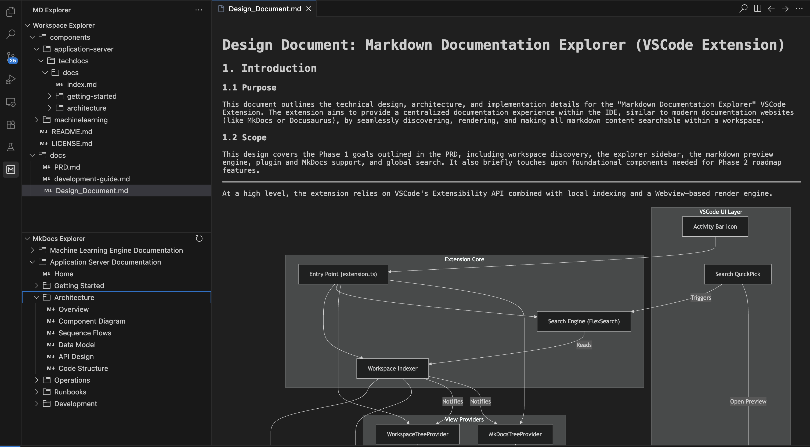

# Markdown Documentation Explorer

Markdown Documentation Explorer is a powerful VS Code extension that automatically discovers, organizes, renders, and searches all markdown documentation in a repository. It provides a centralized documentation experience inside VS Code, enabling developers to explore and navigate documentation similar to a dedicated documentation website (like MkDocs or Docusaurus) without ever leaving the IDE.

---

## 🌟 Features

- **Workspace Markdown Discovery**: Automatically indexes markdown files across your entire project, including hidden folders and AI-generated docs (`.ai`, `.cursor`, etc.).
- **Dual Sidebar Explorer**: 
  - **Workspace Explorer:** Navigate standard folders and files natively found in your workspace workspace.
  - **MkDocs Explorer:** Automatically detects any `mkdocs.yml` configurations in your workspace and renders a custom hierarchical navigation tree mapping directly to your docs outline.
- **Rich Markdown Preview Engine**: Powered by `markdown-it` with robust plugins:
  - Supports GitHub Flavored Markdown (GFM).
  - Task Lists, Admonitions, and Footnotes out of the box.
  - Auto-translated local image routing (bypassing strict webview security policies).
  - Native Mermaid diagram rendering (`mermaid.js`).
  - Seamless internal cross-file link navigation.
- **Global Documentation Search**: Lightning-fast full-text documentation search using `FlexSearch` with prefix-matching support.
- **In-Document Highlight & Scroll**: 
  - Clicking a result in the global search automatically scrolls to the exact match in the preview and highlights it.
  - A custom built-in floating search bar provides perfectly accurate "find-in-page" within the markdown render.

---

## 🚀 Usage & Shortcuts

### Launching the Explorer
1. Click the **MD Explorer** icon in the VS Code Activity Bar on the far left.
2. Expand the **Workspace Explorer** or **MkDocs Explorer** to browse your `.md` files.
3. Click any document to open it in an interactive Preview Panel.

### Global Search
- **Command Palette:** `Cmd + Shift + P` -> Select `Markdown Explorer: Search globally`
- **UI Button:** Click the `🔍` (Search) icon in the title bar of the Workspace Explorer view.

### In-Document Search
- **Shortcut:** Press `Cmd + F` (Mac) or `Ctrl + F` (Windows) while your focus is anywhere inside a Markdown Preview document. This opens the embedded floating search bar to quickly highlight terms on the current page.

---

## 🛣️ Future Roadmap

We are actively working on improving the Markdown Explorer. Here are the planned features for upcoming releases (Phase 1 Enhancements & Phase 2):

### Preview Enhancements
* **Live Editing Refresh:** Sync rendering directly with your editor changes before saving the file.
* **Scroll Sync:** Sync editor line scrolling natively to preview viewing positions.

### Markdown Plugins
* **Math & Emoji:** Adding support for `KaTeX` (Math expressions) and the `markdown-it-emoji` plugin.

### UI & Navigation
* **Table of Contents (TOC):** Auto-generated TOC sidebar in the preview based on document headings.
* **Favorites:** Ability to pin important documents to the top of the explorer.
* **Recently Viewed:** Maintaining a separate list of recently opened files for quick access.
* **Image Zoom/Lightbox:** Clickable zooming capabilities for natively rendered images.

### System Intelligence
* **Broken Link Detection:** Workspace scanner to flag invalid internal documentation links.
* **Documentation Graph:** Visual graph mapping how documents link to one another.
* **Knowledge Graph & AI Summaries:** Generating relationship clusters and LLM-powered summaries of folders.
* **ADR Support:** Specific architectural decision record templates and detection.
* **Documentation Health Metrics:** Providing stats on doc staleness, coverage, and missing metadata.

---

*For development, testing, and publishing instructions, please refer to the [Development Guide](./docs/development-guide.md).*
