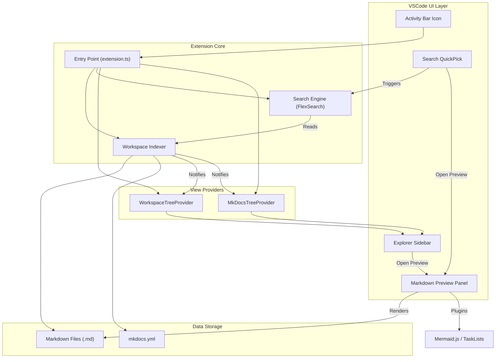

# Design Document: Markdown Documentation Explorer (VSCode Extension)

## 1. Introduction

### 1.1 Purpose
This document outlines the technical design, architecture, and implementation details for the "Markdown Documentation Explorer" VSCode Extension. The extension aims to provide a centralized documentation experience within the IDE, similar to modern documentation websites (like MkDocs or Docusaurus), by seamlessly discovering, rendering, and making all markdown content searchable within a workspace.

### 1.2 Scope
This design covers the Phase 1 goals outlined in the PRD, including workspace discovery, the explorer sidebar, the markdown preview engine, plugin and MkDocs support, and global search. It also briefly touches upon foundational components needed for Phase 2 roadmap features.

---

At a high level, the extension relies on VSCode's Extensibility API combined with local indexing and a Webview-based render engine.



### 2.1 Core Components

1.  **Extension Context / Activator**
    *   Entry point for the extension (`extension.ts`).
    *   Registers commands (e.g., `markdownExplorer.openPreview`, `markdownExplorer.search`).
    *   Discovers configuration settings from `package.json`.

2.  **Workspace Indexer Service**
    *   Scans the workspace for `.md`, `.markdown`, and `.mdx` files upon activation.
    *   Listens for file system events (create, update, delete) to keep the documentation state synchronized automatically.
    *   Detects `mkdocs.yml` configurations and AI-specific folders (`.ai`, `.cursor`, etc.).

3.  **Explorer Tree Provider**
    *   Implements `vscode.TreeDataProvider`.
    *   Builds the hierarchical representation of the documentation files mapping directories to Tree Items.
    *   Provides two distinct tree views:
        *   **Standard Explorer:** Normal file system groupings (including AI folder segregation).
        *   **MkDocs Explorer:** Navigation graph populated exclusively by reading `mkdocs.yml`.

4.  **Markdown Render Engine**
    *   Wrapper around the `markdown-it` library.
    *   Extends base rendering with plugins (Mermaid, KaTeX, task lists, admonitions).
    *   Handles internal link resolution to translate relative file paths into Webview-compliant local resource URIs, or intercepts clicks to trigger cross-document navigation.

5.  **Webview Preview Controller**
    *   Manages the VSCode Webview Panels used for displaying content.
    *   Injects the HTML rendered by the Markdown Engine along with the necessary CSS (e.g., GitHub markdown style, syntax highlighting) and client-side JavaScript (e.g., Mermaid.js runtime, scroll sync).

6.  **Search Engine**
    *   Utilizes `flexsearch` to build an in-memory full-text search index of all discovered markdown files.
    *   Exposes a Search UI (via VSCode's Quick Pick or a custom Webview search panel) to handle title, heading, and body content queries.

---

## 3. Data Models

### 3.1 `DocumentNode`
Represents an item in the tree view (either a folder, an AI grouping folder, or a document).
```typescript
interface DocumentNode {
    id: string;              // Unique identifier (usually the absolute path)
    label: string;           // Display text in the tree
    type: 'file' | 'folder' | 'ai_group' | 'mkdocs_group';
    uri?: vscode.Uri;        // URI for files
    children?: DocumentNode[]; // For folders
    metadata?: DocumentMetadata;
}
```

### 3.2 `DocumentMetadata`
Stores additional parsing info such as frontmatter, headings, or detected broken links.
```typescript
interface DocumentMetadata {
    title: string;
    headings: { level: number, text: string, slug: string }[];
    favorite: boolean;
    lastAccessed: number;
}
```

### 3.3 `MkDocsConfig`
Parsed representation of `mkdocs.yml` used by the MkDocs Explorer.
```typescript
interface MkDocsConfig {
    site_name: string;
    nav: Array<string | Record<string, string | any[]>>;
}
```

---

## 4. Component Details & Implementation Strategy

### 4.1 Workspace Discovery & Indexer
*   **Initial Scan:** Use `vscode.workspace.findFiles('**/*.{md,mdx,markdown}', '**/node_modules/**')` for an optimized initial fetch. The exclusions will respect the user's `markdownExplorer.includeHiddenFolders` setting.
*   **Live Updates:** Utilize `vscode.workspace.createFileSystemWatcher()` to watch for `.md` additions, modifications, and deletions. This avoids full rescans and keeps performance optimal in large repositories.
*   **AI Folder Detection:** A hardcoded (but configurable) list of patterns (e.g., `.ai/`, `.cursor/`, `.bmad-methods/`) will be mapped to an aggregated "AI Docs" node in the tree structure.

### 4.2 Sidebar & Tree Views
*   Register two views in `package.json` under `views`:
    1.  `markdownExplorerView` (Standard Workspace view)
    2.  `markdownMkdocsView` (MkDocs structure view)
*   The `TreeDataProvider` implementation will lazily load children folders by returning child nodes only when a parent node is expanded, mitigating UI lag for massive repositories.
*   Recently Viewed and Favorites can be stored globally using VSCode's `ExtensionContext.workspaceState` or `globalState`.

### 4.3 Markdown Rendering Engine (Webview)
*   **Engine Setup:**
    ```javascript
    const md = require('markdown-it')({ html: true, linkify: true })
        .use(require('markdown-it-task-lists'))
        .use(require('markdown-it-admonition'))
        .use(require('markdown-it-footnote'));
    ```
*   **Mermaid Integration:** Instead of fully rendering diagrams on the Node.js backend, the markdown renderer identifies ````mermaid` blocks and outputs them as `<div class="mermaid">...</div>`. The client-side JS injected into the Webview will call `mermaid.init()`.
*   **Resource Handling:** VSCode Webviews prevent normal `file://` URIs for security. All local images referenced in markdown will be converted using `webview.asWebviewUri(vscode.Uri.file(imagePath))`.
*   **Cross-File Navigation:** `<a href="...">` tags generated by `markdown-it` will be intercepted by client-side JS executing in the Webview. Based on the `href`, a message is posted back to the extension host (`vscode.postMessage({ command: 'openLink', href: '...' })`), which triggers opening a new preview or updating the current one.

### 4.4 Global Search
*   When the indexer discovers files, a background worker (or optimized chunked queue) reads their contents.
*   The textual body, headings, and filenames are indexed into a `FlexSearch` instance with optimized scoring.
*   The search UI can be implemented using VSCode's native QuickPick (`vscode.window.showQuickPick`) detailing the file and a snippet line, or potentially a dedicated Webview Search Panel.

---

## 5. Third-Party Libraries Stack

| Library | Purpose |
| :--- | :--- |
| `markdown-it` | Core Markdown-to-HTML parsing |
| `markdown-it-mathjax3` / `katex` | Mathematical formulas & rendering |
| `mermaid` | Client-side diagram generation (via webview JS) |
| `js-yaml` | Parsing `mkdocs.yml` configurations |
| `flexsearch` | Full-text, fast prefix search engine |
| `cheerio` (optional) | HTML manipulation if needed before webview injection |

---

## 6. Performance & Security Considerations

*   **Asynchronous Indexing:** Do not block extension activation with parsing operations. File reads and search index building should happen in non-blocking batches via `setImmediate` or Worker threads.
*   **Webview Content Security Policy (CSP):** The Webview should employ strict CSP headers to restrict resource loading only from the extension's assets directory and the active workspace root.
    ```html
    <meta http-equiv="Content-Security-Policy" content="default-src 'none'; img-src vscode-webview-resource: https:; script-src 'nonce-${nonce}'; style-src vscode-webview-resource: 'unsafe-inline';">
    ```
*   **Memory Footprint:** Limit the size of documents read entirely into memory for the `flexsearch` index. For gigabyte-sized repos, only filenames and headings might be kept entirely in memory unless deep search is explicitly toggled.

---

## 7. Configuration Settings Schema (`package.json`)

```json
"configuration": {
  "type": "object",
  "title": "Markdown Explorer",
  "properties": {
    "markdownExplorer.includeHiddenFolders": {
      "type": "boolean",
      "default": true,
      "description": "Include hidden folders like .github, .ai in the tree."
    },
    "markdownExplorer.enableMermaid": {
      "type": "boolean",
      "default": true
    },
    "markdownExplorer.enableMkDocs": {
      "type": "boolean",
      "default": true,
      "description": "Parse and show the MkDocs Explorer if mkdocs.yml is found."
    }
  }
}
```

---

## 8. Development Phases

**Phase 1.1: Core Infrastructure**
*   Set up Webview hosting.
*   Implement `markdown-it` rendering and standard VSCode markdown parity.

**Phase 1.2: Explorer & Discovery**
*   Build Workspace Indexer.
*   Implement standard `TreeDataProvider` including AI group logic.

**Phase 1.3: MkDocs & Plugins**
*   Integrate parser for `mkdocs.yml`.
*   Implement second TreeView specific for MkDocs.
*   Integrate Mermaid.js, KaTeX, Admonitions.

**Phase 1.4: Search enhancements**
*   Initialize `flexsearch` indexes.
*   Map QuickPick UI to search hits returning markdown slices.

**(Phase 2) Future:**
*   Graph/Node visualizations for doc relationships.
*   ADR discovery and Health metrics (broken links highlighting).
*   AI Summaries.
